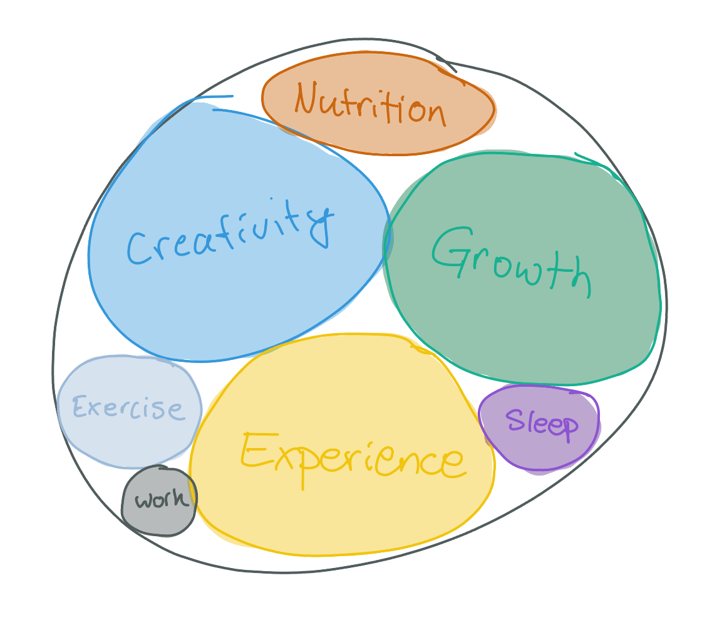

I started off not knowing anything was "wrong."

I just needed to work harder, make more money, and eventually, I would have the life I always wanted, one filled with joy, discovery, and freedom.

That was...obviously not true.

But how could I have known? Things were *working*. I mean, sure I would have low times and hard times, and sometimes things would blow up in my face in unexpected ways, but that just seemed to be how life *was*. Not anything I could do about it.

I did have a pitiful habit of imagining what it would be like to have The Perfect System™, which would allow me to be productive, focused, and never miss or forget anything (which I seemed to have a strange and unfortunate habit of doing).

I would imagine, conceive, and even test systems of productivity, that were supposed to carry me safely to the promised land. Things like calendars planned down to the minute, bullet journals obsessively carried with me everywhere, Personal CRMs for managing friends *and* professional contacts, omni-search tools across my whole browsing and messaging history, ebook readers that let me write, share, and browse marginalia, and most recently, an everything LLM connected to everything I do. This last one was so exciting! It would somehow collect and manage everything I do or see and bring the right stuff to my eyes, contextually, whenever I needed it, before I knew I needed it. (...and then what? I didn't get to thinking that far.)

Anything to avoid living intentionally. Anything to escape my inherent limitations as a human being.

But this all makes perfect sense! If you know my story, it's plainly and painfully obvious to trace from the trauma to all of these incessant behaviors. Losing my perfect family as a kid, living under an abusive stepfather, living in the empty shadow of my real father, moving around to five different cities before high school, going to five different high schools...and those were the things out of my control! And some of the things I did that were *in* my control traumatized me even worse.

I ended up primed and ready for a "mid-life crisis," right on time.

I worked so hard to make my marriage everything I thought it could be — two people learning, growing, and discovering this world together, and I finally realized that it would never happen, and that if we brought kids into the mix (something it only seemed I really wanted), I'd be responsible for holding it all together. I couldn't do it. I wouldn't do it.

In the wake of that spectacular implosion, and several intense relationships later, I've finally decided to give up on relationships as the thing to save me. I've finally decided to stop trying to "save mom."

I think the idea was this:
1. Find a woman who can tolerate me.
2. Resolve to make her safe, happy, and secure. 
3. ????
4. Profit...?

Underlying all of this is what I learned in my childhood — if I take care of mommy's feelings and experience, there might be something left over for me. I might get a chance to be comforted and loved... and boy do I need it.

There were other aspects to this, too. I wanted to caretake. I wanted to give some of the love, care, and attention that I knew I missed out on. I felt like, if I couldn't get it, at least I could give it to someone else. I thought it was my responsibility.

And I had a subconscious belief that if I gave my partner a wide berth, all the space, leeway, and understanding to figure her stuff and herself out, she might return the favor. But... no. It just meant more demands. It always meant more demands. Being caring and accommodating was always met with a "Please, sir, can I have some *more*?"

Along the way, I met some interesting people. One guy I met on a plane, after fortuitously deciding not to wear my headphones. I sat next to him and we started a conversation, small talk mostly, but I ended up talking about myself and my ambitions. "You'd really like my course," he said. "You know what? I'll let you take it for a dollar."

Looking back, that feels like the first real crack in the veneer. I had already been careened off course — divorced, post-marriage relationship in shambles, thinking "this is it, I'm free, I can finally make my life into everything I know it can be." And then this guy shows up and shows a little compassion for the grown-up kid, sitting next to him on the plane, telling him how he wants to change the world. I'll always be grateful.

From there, I continued to wrestle with that relationship a bit. I decided that it wasn't working, so I offered to move out so we both could have some space to reflect and connect with what we truly wanted. "We're broken up," she concluded. I was stunned, but I had to accept it.

I traveled, quit my job, and tried to freelance free time. I spent the better part of 2023 burning through my savings and rolling around in the existential mud.

I went through two more relationships. The first showed me that I *did* have some good qualities and I *was* desirable, after all. It also showed me that I could have boundaries and I could say, "enough is enough" when enough had truly become enough.

The second one is the one that really uncorked my head out of my ass.

I dated a Type-A woman who was more driven than me and more focused, and knew exactly what beats she wanted her life to take. I admired the hell out of her, and she loved me to death. It was a lot of pressure, to try to "figure my stuff out," as I struggled to dislodge from my muddy muck. She tried to be patient. I tried to be a good partner. I think we both benefitted from that relationship more than any others in either of our lives.

That's the story I like to tell, at least. I taught her how to sit with her emotions, that her anger and insecurity weren't unacceptable, but instead beautiful parts of who she is (and I still find them beautiful...what a wonderful, lovely person she was — magnificent is the word that comes to mind — I loved how fierce and powerful she became when she was angry), and that changed how she interacted with her colleagues *and* her family.

And she showed me something similar: my unbearable guilt and shame, and the mess that they were meant to hide, were not unforgivable nor unbearable at all, they were part of me, and I was never going to excise them. It was finally okay to feel them. And feel them I did. Whew, did I feel them! And, as I did, I realized that the path I was on was really not for me. I listened to non-dual speakers, I meditated, I tried to find peace in my situation, and I struggled against her, trying to assert myself and my needs, without hurting her or making her feel like she was unacceptable.

In the end, we just weren't compatible. That's the story I tell now. The lifestyle she wanted, and the one I wanted, meant that we would always conflict in the same way, over and over. I continued to assert my fledgling sense of self, and she began to tire of it. I had a long way to go, of course, and I couldn't clearly communicate what I felt or wanted, for fear of hurting her, but it was something like, "I don't want to be responsible for your emotions, and I want the right to tell you that I can't handle something. I'd like the right to tell you no."

I think I may have handled it worse than I thought I did at the time. I remember one of our last "discussions," she was upset because I wasn't showing much care or concern. And I simply said, "I don't want to." That was the truth. She was feeling stressed out about her life, and she wanted me to tell her that everything was going to be fine, that we were going to work everything out, and I told her that I didn't want to say that.

I had said that too many times in my life, and it led me down many dark paths, trying to make it true, throwing myself back onto the pyre, and I never wanted to do it again. "I'm here for you. I'll be here with you. I'm engaging with you, and I'm not going anywhere. But, I can't promise that everything is going to work out in that way. I won't make a promise I can't be sure to keep."

And that was pretty much it. She finally said, "I don't think I can do this anymore."

Whew. 😥

And, now I'm here. Living alone, in a beautiful, peaceful house I bought on a lark when the proceeds from my massive year of mid-divorce, three-job overwork started to burn a hole in my pocket, with an economic recession looming on the horizon...

It's nice here.

I needed rest. Even after I got here and moved back in, I was still spinning, spinning, spinning. I would head into the city two or three times a week. I was writing and planning big, ambitious goals. I was trying to figure out how to save my story. I was trying to date. It felt a bit like those scenes in the movies where the hero is battling to eke out a win, and the game is all but lost, but the hero becomes more frantic and more desperate, until in a final moment, it dawns on them that *this cannot be saved*. The game can't be won. And not only that, but their frantic thrashing is hurting the ones they care about.

In this case, I was hurting myself.

I finally realized that my attempts to process my stuff, to make my life work, to find new and clever ways to do the same things I've always been doing, without falling into the same patterns, and to cautiously stick my neck out to look for love — none of these things were working. And worse, they were hurting me. Day by day, I've been running myself ragged. Sleeping less, eating more, running around neglecting my need for quiet reflection and boring rest.

And when I realized that, it was **super** painful. I realized that I'd never achieve the things I was promising myself. I would never fulfill the fantasies that I was using to pad myself against the painful, prickly reality around me. I had to let them go, and I had to feel the thousand stings.

I did. It was miserable. I dragged around. I realized, in the depths of my depression, of my despair and disillusionment, that I could just feel it and keep moving, and I could let my mind do less. I didn't have to look to my mind to "make this okay." I didn't need to let my mind chew on the problem and try to solve it all. To balance all of the remainders and make it perfect. I could just let it be a disappointing, hopeless, mess. I was still here, and I could focus on me.

I decided that the biggest problem in my life, as simple as it sounds, was a case of inverted priorities.

Since I was 15 and my world began taking on an eerie, existential tinge, I've wondered long and hard about why I'm here, and what this is all for. After much rumination and revisiting, I decided it was about three things. I'll write the manifesto later. But they are: experience, growth, and creativity. Seeing, feeling, and experiencing things, learning and growing and becoming smarter, stronger, and just *more*, and expressing our true, genuine taste, passion, and flavor into the world. That's what this is *really* about.

As my existential crises deepened, I imagined that finding the "right" ways to pursue and express these aspects of life was what I was missing. I needed to arrange my life so that I was aligned with these things more deeply than anything else. That would save me. That would fix me.

I tried. I even drew a diagram to help illustrate what I thought was the problem:

  
*This is me. The ultimate goal is an emergent phenomenon. The "visible goal" is a big one we can name, one that feels in alignment with the ultimate goal, which we can only sense. We have positive impulses and "bad" habits, and where we end up moving is a sum of all of these.*

  
*Depending on how many old habits you have, you may find that you go in circles. If you can remove them, though, you should be able to actually cover new ground.*

Fun stuff. I think there's still some truth to it, but it's ultimately a tool to make the mind feel like its calling the shots. How many moves do you have to make to "remove" a bad habit? How do you decide what a "visible goal" is? There's so much to do here! My current thinking is so much simpler, now.

The truth is, I still had it wrong.

Sure, experience, growth, and creativity are the pinnacle experiences of life (for me). But, they have to be supported. There are boring things that are necessary to keep life going, and those things need to be taken care of, *first*. Those things need to take priority. Those things are the foundation, upon which the "big three" can comfortably, and stably, rest. Unfortunately, for me, they would always be an afterthought. Even when I thought to "work on" them, I would turn them into just another set of tasks I had to complete, rather than life-or-death activities that would kill me or save me in the long run, depending on how well I did at them.

I decided to throw out the playbook and just [focus on building that foundation](https://x.com/workflowsauce/status/1833685658285821953).

  
*How I'd been approaching my life up until now. I would cram in the big fun stuff that I wanted to do, and I would let the other, foundational things sort of fit in where they could. They would frequently fall out.*

  
*How I am trying to structure it now. I want to put in the "core four," and let them take all the space they need. The "big three" will fill in the gaps. Less time, but way more focused. Surgical. Precise. Secure.*

I wrote a single page to guide my focus for the rest of the year. "It doesn't matter how long it takes," I thought, "I'll continue working on this until I get it down." It had an immediate effect on my mindset and behavior. Having just one thing to focus on has made it so easier to dismiss other thoughts and impulses. I haven't gotten it "perfect," but that doesn't matter. I'm rewiring circuits. I'm rebuilding reward pathways. It's working. I feel more bored, less stressed and anxious, and, most importantly, happier in the *here and now*, which is my new favorite place to be.

  
*My one-pager on getting my foundational behaviors set up properly. The "core four": Sleep, Diet, Exercise, and Work.*

We'll see where all of this goes from here.

But... it's brought some much-needed peace. I'm finally at the center of my world. I think that's where I belong.