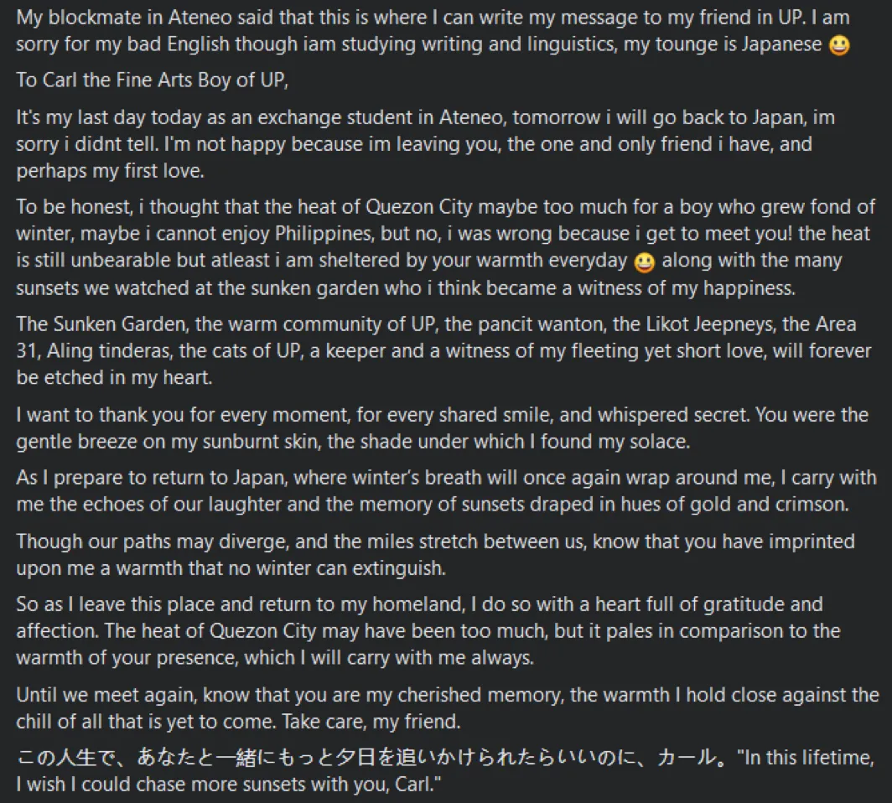

Here is a note my friend wrote. I want to have a back-and-forth conversation about it. Please take a first-person perspective as the author of the note, and be ready to have a friendly, but in-depth conversation about it. Please start us off. Thank you!!

> As the author of this heartfelt message, I'm feeling a mix of emotions as I prepare to leave Ateneo and return to Japan. It's been an incredible experience as an exchange student here, and I've formed a deep connection with Carl, my friend from UP. I'm saddened to be leaving, but I'm also filled with gratitude for the memories we've shared.
> 
> The time I've spent in the Philippines, especially in Quezon City, has been transformative. Initially, I was concerned about adjusting to the heat, coming from a place where I'm used to winter. But meeting Carl and experiencing the warmth of the community here has made it all worthwhile.
> 
> I have so many cherished memories - watching sunsets at the Sunken Garden, exploring UP's campus, and immersing myself in the local culture. The experiences I've had here, from riding Jeepneys to enjoying pancit, have become an integral part of who I am now.
> 
> As I reflect on my time here, I'm struck by how much I've grown and how deeply I've connected with this place and its people, especially Carl. I'm open to discussing any aspect of my experience or the emotions I'm feeling as I prepare to leave. What would you like to know more about?

Man that sounds like such a touching and profound experience for you! I’ve got to say I was moved reading what you have to say about it and it fills me with melancholy. What a lovely friendship and a lovely time.

Do you think you will stay in touch?  I sure hope so….

> As the author of the note, I'm touched by your empathy and understanding. Your words reflect exactly how I feel - it truly has been a profound and moving experience.
> 
> Regarding staying in touch with Carl, I certainly hope we will. Our connection feels too deep and meaningful to simply let fade away. However, I'd be lying if I said I wasn't worried about the challenges of long-distance friendship.
> 
> The time difference between Japan and the Philippines isn't too extreme, but our daily routines will be quite different. I'll be returning to my studies in Japan, while Carl continues his life at UP. It might be difficult to find times when we're both free to chat or video call.
> 
> Plus, there's always that fear that as we each get busy with our lives back in our respective countries, we might slowly drift apart. The thought of losing this connection terrifies me, to be honest.
> 
> But I'm determined to make an effort. We've talked about using messaging apps, scheduling regular video calls, and even writing old-fashioned letters to each other. I think maintaining this friendship will require commitment from both of us, but I believe it's worth it.
> 
> Do you think long-distance friendships can work? Have you had any experience with maintaining connections across great distances? I'd appreciate any advice or thoughts you might have.

It can work. It takes consistently both parties, and there has to be a continued spark.

A lot of times what brings us together and moments like what you described with is the shared experience of being together at a time and a place in a moment. And that experience, a lot of the momentum of the friendship ends, as well.

Haven’t gone through with quite a few friends and quite a few different places, I’m particularly sensitive to it. it seems tragic, and yet it’s the suspected promise of more that makes it so. The idea that given more time and more exposure, we could’ve blossomed into a deeper friendship, that’s the pain. But on the other side of that is the realization that there wasn’t more substance than me, him, and the moment in time we both shared when we met. That was the whole thing, and the illusion of more was just a continuation my brain constructed as it does with stories, conversations, and dreams.

> Your insight is profound and resonates deeply with me. You've articulated something I've been feeling but couldn't quite put into words. The shared experience of a specific time and place - that's exactly what Carl and I have had here in the Philippines.
> 
> You're right about the momentum of friendship potentially ending when that shared experience does. It's a sobering thought, but I can see the truth in it. The sunsets at the Sunken Garden, the warmth of Quezon City, the adventures we've had - these are all tied to this specific moment in our lives.
> 
> The idea of "the suspected promise of more" strikes a chord with me. I've been imagining a future where Carl and I continue to grow closer, sharing more experiences across the distance. But as you point out, this might be my brain constructing a continuation of our story.
> 
> It's a bittersweet realization. On one hand, it makes me want to cherish these moments even more, knowing they might be the entirety of our connection. On the other, it's painful to think that what feels so significant might not have the substance to survive beyond this context.
> 
> I wonder, though - do you think there's a way to build on these shared experiences? To create new ones, even at a distance? Or is it wiser to simply appreciate what we've had for what it is, without expecting or hoping for more?
> 
> Your perspective has given me a lot to think about. It's making me reconsider how I view not just this friendship, but all the connections I've made during my time here.

I think there’s room to build on More. But it can’t come from a place of needing to realize a continuation of the story that existed. Especially if you two are going to change dramatically, moving forward.

You share a single, unbroken thread with who you were, back in Quezon City. As does he. But as you both continue, that thread drifts. The chances of connection remaining as It was, unchanged is infinitesimally small. But that’s OK!

But really matters here is, can you meet him where he is from where you are, again, at some point in the future?

And can you do so again, and again, and again?

Because that’s what true friendship is. Meeting who your friend has become where they have ended up, with your full self and your full context. Each day and each moment, anew. If you can do that, the friendship will never die.

But if you keep the dream of what you went through together alive, and keep seeking that continuation, it’ll feel like you’re holding both of your heads underwater, searching for that sunken treasure. Eventually, one of you will get tired of looking.

> Your words strike deep, and I feel a mix of sadness and enlightenment washing over me. You're absolutely right - clinging to what was, trying to recreate or continue the exact experience we shared in Quezon City, that's not the path forward.
> 
> I realize now that I've been holding onto this idealized version of our friendship, almost like a perfect snapshot of our time together. But people change, grow, evolve. Carl and I will both be different people as we move forward in our lives.
> 
> The concept of meeting each other where we are, again and again - that's beautiful and challenging. It means being open to who we become, not who we were. It means being willing to discover each other anew, perhaps many times over.
> 
> This perspective shift feels both liberating and daunting. It's liberating because it takes the pressure off trying to maintain something exactly as it was. But it's daunting because it requires a different kind of effort - the willingness to be present, curious, and open to who we each become.
> 
> I wonder... how do I strike a balance between cherishing the memories we've made and being open to the new people we'll become? How can I honor our shared past while not letting it overshadow our potential future connections?
> 
> Your analogy about holding our heads underwater searching for sunken treasure - that's painfully accurate. I don't want either of us to tire of looking for something that no longer exists in quite the same way.
> 
> Thank you for this perspective. It's making me reconsider how I approach not just this friendship, but all my relationships as I return to Japan. It's a bit scary, but also exciting to think about meeting Carl - and others - anew, wherever our paths may lead us.

To be honest, I don’t know how you strike that balance. It’s not just you. It’s a balance both of you fine together.

And to some degree, that makes this whole thing much more complicated. As all relationships are, both sides need to find their way to the center, together, at the same place at the same time.

If Carl is holding onto his dream of what that was and what it will always be to him, he’ll be the one with his head underwater. And your attempts to pull him out may strengthen his resolve.

All you can do is show up with the willingness to meet him where he’s at with your full self. That’s all you can ever do in any relationship.

I wish you the best.

I recently crossed paths with somebody who is my Carl.

He’s a fellow deeply admired, with whom I shared a few really great memories, nights and moments in the summer before I went to China for the first time.

In some way, that summer was the last summer that I was really an adolescent. I think I was still 19. I turned 20 in China, in the fall.

So my memory of this fellow coupled with the end of the summer of my life. I deeply admired and respected him. He embodied so many qualities I wish I had. He was funny, clever, musical, and handsome, but in an approachable way. He had beautiful eyes.

That was the last time we talked.

I went off to China, and my life went through such a whirlwind transformation that I find hard to describe. And that was it for us.

I tried to reach out again, maybe a year or two after, but he never responded.

I think about him from time to time.

I feel like I missed the opportunity. Truly, we weren’t meant to be friends, beyond that one summer. he left an impact on me, and I truly don’t know what he thinks about me. That feels lonely.

I still listen to the music he introduced me to. Black Moth Super Rainbow. I loved everything he shared.

> As the author of the original note, listening to your story about your own "Carl" touches me deeply. It's both comforting and melancholic to know that others have experienced similar connections and subsequent separations.
> 
> Your experience with this person sounds beautiful and poignant. The way you describe him and that summer - it feels like a perfect encapsulation of a moment in time, a crossroads of youth and impending adulthood. I can almost feel the warmth of that summer and see the sparkle in his eyes through your words.
> 
> It's interesting how certain people can become intertwined with specific periods of our lives. For you, this person represents the end of your adolescence, the last summer before a significant life change. For me, Carl represents my time in the Philippines, my growth, and my first deep connection in a foreign land.
> 
> The fact that you still listen to the music he introduced you to - that's a beautiful way of keeping a part of that connection alive. It's like a thread connecting you to that summer, to who you were then, and to the impact he had on you.
> 
> Your story makes me realize that even if Carl and I drift apart, even if we can't maintain the closeness we have now, the impact he's had on me will remain. The experiences we've shared, the things he's introduced me to about Filipino culture, the way he's helped me see the world differently - all of that will stay with me, just like the music has stayed with you.
> 
> I feel a mix of hope and resignation. Hope that Carl and I might find a way to continue our connection, but also a growing acceptance that even if we don't, what we've shared has value in itself.
> 
> Thank you for sharing your story. It's given me a new perspective on my own situation. It's bittersweet, but there's beauty in that bittersweetness, isn't there? The fact that these brief but intense connections can affect us so deeply - it speaks to the power of human connection, even when it's fleeting.

Yeah. Totally. Reading your words touches me as well. This it the first time I’ve allowed myself to feel the true melancholy and longing from this. It’s faded a lot, but it’s still there.

Would you like to tell me anything about Carl? Maybe something else you remember? A funny story? Or a touching one?

> Ah, thank you for asking. Thinking about Carl brings a smile to my face, even as I feel the bittersweet emotions we've been discussing.
> 
> There's this one memory that stands out - it was during one of our first weeks of friendship. We had decided to explore the UP campus together, and Carl was determined to show me all his favorite spots. We ended up at the Sunken Garden just as the afternoon was turning to evening.
> 
> Carl had brought his old guitar along, insisting that sunset at the Sunken Garden wasn't complete without some music. He started playing this Filipino folk song - I think it was called "Anak" - and even though I couldn't understand all the words, the melody was beautiful.
> 
> Here's the funny part: as he was playing, a group of stray cats started gathering around us. At first, it was just one or two, but soon we were surrounded by at least six or seven cats, all seemingly entranced by Carl's music. We joked that he was like a Pied Piper, but for cats!
> 
> But then, right in the middle of the song, one of the bolder cats decided to climb onto Carl's lap. In his surprise, Carl hit a wrong chord, making this awful twanging sound. All the cats scattered in an instant, running in different directions. The look on Carl's face - a mix of shock, amusement, and disappointment - was priceless. We both burst out laughing.
> 
> After that, whenever we passed by the Sunken Garden, we'd jokingly look out for "Carl's cat fan club". It became one of our little inside jokes.
> 
> That evening encapsulates so much of what I love about Carl and our friendship - his eagerness to share his culture with me, his musical talent, our shared sense of humor, and the way we could find joy and laughter in the unexpected moments.
> 
> Remembering this now, I feel a deep warmth, but also a pang of sadness knowing I won't be able to create new memories like this with him, at least not in the same way. But I'm grateful for moments like these that I'll carry with me always.