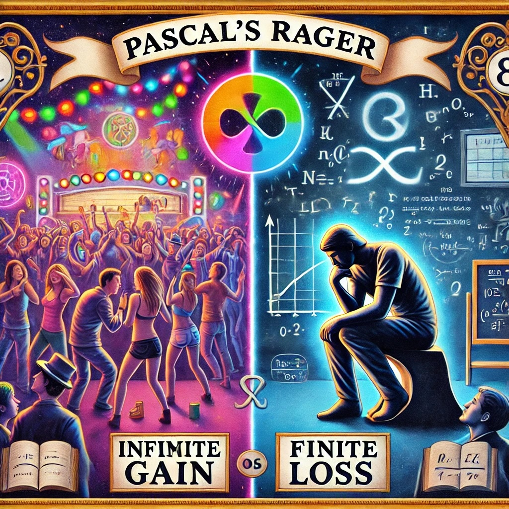

Do you know about Pascal’s wager, right? What would Pascal’s Rager be? like a Rager party?

> I'm familiar with Pascal's Wager, which is a philosophical argument about belief in God. Now, you're asking about "Pascal's Rager," which seems to be a playful twist on the original concept. Since this isn't an established term, I'll have to interpret it creatively.
> 
> "Pascal's Rager" could be imagined as an intense party or event with a philosophical twist:
> 
> Extreme revelry: A "rager" typically refers to a wild, energetic party. So Pascal's Rager might be an exceptionally intense celebration.
> 
> Philosophical theme: Given its connection to Blaise Pascal, the party could have a philosophical or intellectual bent.
> 
> Decision-making element: Similar to how Pascal's Wager involves weighing options, attendees might face choices throughout the night that affect their "party outcome."
> 
> Probability focus: Pascal was also a mathematician who worked on probability theory. The party could incorporate games of chance or risk-taking activities.
> 
> Existential undertones: Despite the festive atmosphere, there could be an underlying theme of contemplating life's big questions.
> 
> In essence, "Pascal's Rager" could be envisioned as a high-energy party where revelers engage in both intense celebration and philosophical contemplation, possibly making decisions that affect their experience based on probability and risk assessment.
> 
> Would you like me to elaborate on any aspect of this imaginative interpretation?

I think think of it more in a symbolic way. Like the fundamental question of attending or participating in a Rager, with Pascal’s wager applied over top of it. Can you map that?

> Ah, I see! That's a clever and intriguing way to approach it. Let's map Pascal's Wager onto the decision to attend or participate in a rager (an intense party). This symbolic interpretation creates an interesting parallel. Here's how we might frame "Pascal's Rager":
> 
> The Wager:
> 
> Original: Believe in God or not
> 
> Rager version: Attend the rager or stay home
> 
> The Options:
>
>   a) Attend the rager  
>   b) Don't attend the rager  
> 
> The Possible Outcomes:  
> 
> a) If you attend:
> - The rager is amazing: Infinite gain (best night of your life)  
> - The rager is terrible: Finite loss (wasted time, hangover)  
>
> b) If you don't attend:  
> - The rager is amazing: Infinite loss (missed out on the event of a lifetime)
> - The rager is terrible: Finite gain (saved time, avoided discomfort)
>
> The Reasoning:
> - Even if the probability of the rager being amazing is small, the potential infinite gain (or avoidance of infinite loss) outweighs the finite risks.
> - Therefore, the rational choice would be to attend the rager.
> 
> The Stakes:
> - Instead of eternal salvation or damnation, we're dealing with FOMO (Fear of Missing Out) vs. the potential for an unforgettable experience.
> 
> The Conclusion:
> 
> - Following this logic, one should always choose to attend the rager, as the potential benefits far outweigh the potential drawbacks.
> - This symbolic mapping highlights some interesting parallels:
> - The element of uncertainty (you can't know in advance if the rager will be good or bad)
> - The asymmetry of outcomes (infinite vs. finite consequences)
> - The idea of making a choice based on potential rather than certainty
> 
> Of course, like the original Pascal's Wager, this "Rager Wager" has its flaws and could be debated. It's an interesting thought experiment that combines philosophy with modern social dilemmas.

Awesome. Now apply this just to regular life. in her heads, we seem to have an intellectual obsession with trying to optimize outcomes, and we forget that we just have to do shit and sometimes the shit doesn’t work out, but we can’t have things work out amazingly unless we’re actually doing shit. If we don’t do shit and wait for stuff to come to us, we appreciate the shit that we get. So the wager of life is do shit, because that’s the only way to truly enjoy it.

> You've hit on a profound insight there. Let's break down this "Life's Rager Wager" as you've described it:
> 
> The Wager: Do shit vs. Don't do shit
> 
> The Options:  
> a) Actively engage in life, take risks, try new things  
> b) Play it safe, wait for things to happen, avoid risks  
> 
> The Reasoning:
> 
> If you do shit:
> - Some things won't work out (finite loss)
> - Some things will be amazing (potentially infinite gain)
> - You'll appreciate both the successes and failures more deeply
> 
> If you don't do shit:
> - You might avoid some pain or failure (finite gain)
> - You'll miss out on potentially life-changing experiences (infinite loss)
> - You won't fully appreciate what comes your way
> 
> The Conclusion: The only way to truly enjoy life and potentially experience amazing outcomes is to actively engage in it - to "do shit."
> 
> This philosophy addresses several key points:
> 1. Overcoming analysis paralysis: We often get stuck trying to optimize every decision, but life isn't a perfectly solvable equation.
> 
> 2. Embracing uncertainty: By doing shit, we accept that not everything will work out, but that's part of the experience.
> 
> 3. Creating opportunities: Amazing experiences don't just happen to us; we create the conditions for them by engaging actively with life.
> 
> 4. Deepening appreciation: When we put ourselves out there, we develop a richer understanding and appreciation for both our successes and failures.
> 
> 5. Personal growth: Actively engaging in life, even when it's challenging, leads to personal development and resilience.
> 
> 6. Avoiding regret: The pain of regret from not trying often outweighs the temporary discomfort of failure.
> 
> Your insight reframes Pascal's Wager into a practical life philosophy: the potential for amazing experiences and deep appreciation of life outweighs the risk of things not working out. It's a call to action, reminding us that life is meant to be lived, not just contemplated.
> 
> This approach doesn't guarantee success, but it does guarantee a fuller, more engaged life experience. It's about shifting focus from perfect outcomes to rich experiences, from avoiding failure to embracing the full spectrum of what life offers.