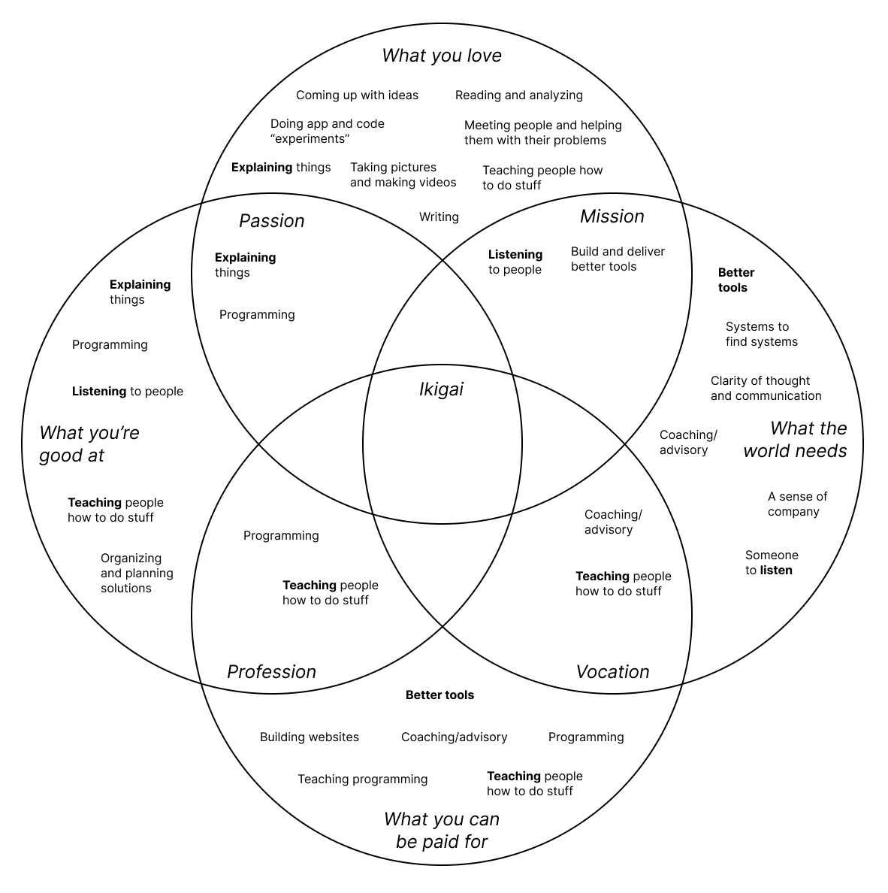
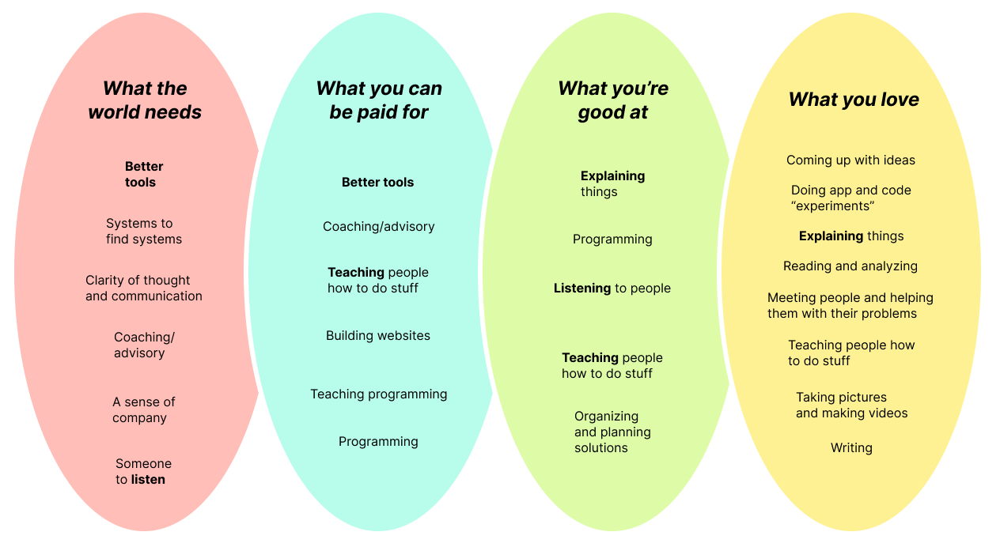

# Ikigai, flattened

The new way of doing Ikigai.

Aim to give the world what it needs, by selling what I can be paid for, for which I will do what I'm good at, in the way I love.

The linear refinement approach:
1. Start with what the world needs — what will I try to deliver?
2. What is sellable along the way?
3. How do I build it? What skills am I missing?
4. What spin or flavor do I put on it, so I can spend as much time doing what I love as possible?

Let's try this.

# My personal list

*The old way...get stuck trying to drill into the middle.*

1. What I love ❤️ (the how)
	* Coming up with ideas and thinking of things from different angles
	* Doing app and code experiments with no regard for "commercial appeal"
	* Explaining things and making complex things digestible
	* Reading and analyzing info and trying to understand complex or confusing things
	* Meeting people and getting to know them and helping them with their problems
	* Taking pictures and making videos
	* Teaching people how to do stuff
	* Writing
2. What I'm good at 💪🏼 (the what)
	* Explaining things
	* Programming and building apps from scratch
	* Listening to people and making them feel heard
	* Teaching people how to do stuff
	* Organizing and planning solutions
3. What I can be paid for 💰 (the how)
	* Programming
	* Building and selling SaaS tools
	* Building apps and websites
	* Coaching and advisory services (apps, programming, career)
	* Teaching programming
	* Teaching other things
4.. What the world needs 🌎 (the why)
	* Better tools
	* Systems to find systems
	* Clarity of thought and communication
	* Coaching, advisory, and guidance
	* A feeling of companionship
	* Listening and empathy
	* Community and organization

*The new way. Start from the broad stuff you're attracted to most, and fine-tune with your specific details.*

# Reorienting

*What does the world need?*

The world needs systems and communities for clarity and communication and organization. It needs a widespread cultural change in which people think more curiously and completely about themselves and the world around them, and work intelligently to find alignment and harmony.

For example. Say I want to eliminate world hunger. How do I understand the problem? Who is an authority? How do I figure out where I fit in to this? How do I understand myself and why I even care? Who can I connect to at or around my level, so I can get the most leverage for my skills? How do I communicate and organize with them effectively?

*What is sellable?*

**Enterprise** — Tools for organization and communication. For asking and structuring problems, and for sharing the understanding gleaned from the task of asking and structuring them in the most effective and efficient way. Collaborative knowledge hives.

**Individual** — Hobby tools for unaffiliated users to do the same thing on an individual level. A way for them to share and structure their knowledge. Simple, cost-plus models for delivery.

**Government** — Lucrative contracts for making government more efficient and communicative, and for opening up new lines of communication both into and about government.

*How do I build it?*

I can build most of the SaaS stuff myself. I need a ton of input on how to approach selling and serving actual use cases. I need users and clients. I need other builders who want to do the same thing. I need to write and publish my journey. I can have an onboarding process.

*What flavor?*

Well, so much of this big problem is something I love. Coming up with ideas, doing experiments. Maybe I can build things and try to get contracts and hire people to "productionize" things when they're sellable. In the meantime, I can spend most of my time thinking, tweaking, and talking to people (academics, users, etc). And making content.