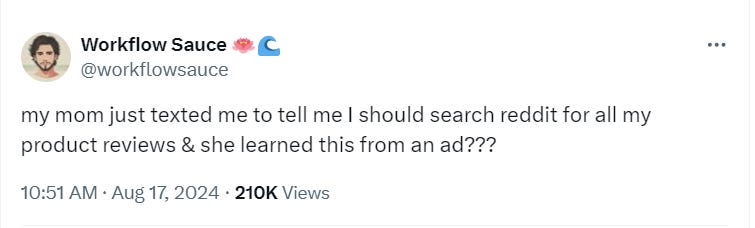
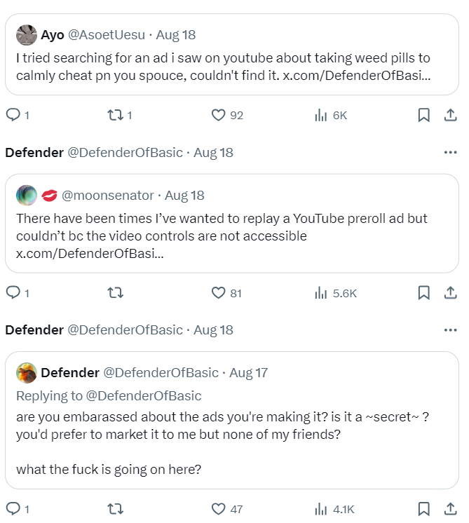
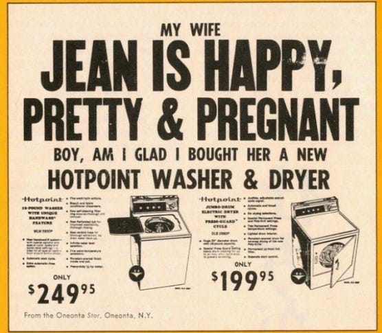
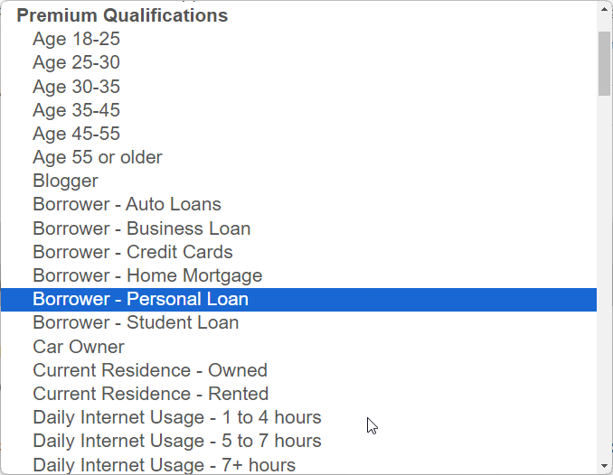

[Last week I started](https://defenderofthebasic.substack.com/p/i-started-writing-a-book) writing an open source book about my vision for the best possible future.

I’m not writing scifi, it’s not a fiction thing. It’s a todo list. I’m playing a game of: talking about what I’m planning to work on to (1) contribute to a better world (2) make lots of money & fame for myself. If someone steals my open todo list, maybe they’ll make lots of money instead of me, but I will still get the world I wanted. Win win!

> 💬 WS: This is a good strategy. Align your incentives with the general incentives of the public. It's like handing out seed packets to everyone you meet. Some of your stuff will take root!

This post is my first attempt at a chapter of this book, inspired by an ad I saw. It’s a narrative about our world, written from the perspective of a future historian. Everything you read falls into one of 3 categories:

🔮 predictions (about what I think will happen/what I want to happen)  
🎥 history (stuff that has *already* happened/just starting to happen)  
🌀 retro-predictions (stuff I wrote as prediction but readers pointed out has actually already happened)

An answer key to reveal what is fiction & what is fact is linked to at the end.

***

> 💬 WS: I have to be honest, I find this a bit hokey, but when I give it a chance, it's actually a REALLY good idea. You're providing the structure that people need to approach this like a scientist/student. You get them thinking critically, up front, making judgements and then evaluating them, and that is ⭐️. I would love if we had a plugin that lets them mark their predictions and then get a score. A "quiz essay," if you will.

By the early 2020’s, everyone hated ads, and yet they were everywhere.

> 💬 WS: 🎥

Things weren’t getting any better, and people didn’t understand why. The reason was very simple in hindsight: it was because ads weren’t actually bad for society.

> 💬 WS: 🌀

Ads were in fact critical infrastructure responsible for most things people loved. That was the reason they were so hard to get rid of. It wasn’t because people had no agency, it was because people didn’t really want them gone. People who lived to see this shift were surprised that a better future turned out to be one with even *more* ads, not less!

> 💬 WS: 🔮

Historians argue over when exactly this shift happened, when society realized that consumers & companies were all on the same side:

* consumers wanted products & services that improved their life,

  > 💬 WS: 🎥

* companies made products that consumers wanted,

* BOTH were against those who abused the system to sell things to people who didn’t want it

> 💬 WS: 🔮

Once this shift happened, it was unstoppable. It wasn’t a law or regulation, it was a change in culture that gave individuals more agency, gave good companies *a lot* more money, and made all products more affordable & efficient. Win win!

> 💬 WS: 🔮

The only people against it were companies that made bad products and relied on paid for SEO spam reviews to sell to uneducated buyers. But they lost. No one wept for them.

> 💬 WS: 🌀

## The first ad with positive externalities

The exact copy was never recorded, but it went something like this:

> This is Gycolic Acid
> 
> It exfoliates your skin.
> 
> It’s a chemical  
> just like water is a chemical, and oxygen is a chemical.
> 
> It can cost you $40.
> 
> or $13

It was just an ad for some skin cream.

> 💬 WS: 🔮
> I like the ad example. But, I think you might consider learning a bit about ads (benefits and empathy), and see if that reframes how you see your "ideal" ad.

Only a few people recognized why this was brilliant: the ad was honest, AND it taught the consumer something true & useful.

> 💬 WS: I do think consumer education is a great way to sell. I've built a ton of rapport with clients through eductating them and treating them like partners and not consumers.

Back then, consumers were not very savvy. They didn’t understand why some brand name drugs cost a lot more than others, even though they had the same “active ingredient”. To be fair to the people: this wasn’t obvious. Some brand name things *are* higher quality. Some are exactly the same.

> 💬 WS: 🎥

The brilliance of this ad was that instead of communicating: “buy our product, it’s better”, it explained why. It didn’t ask people to trust this company, it told them true information that they could use to make decisions, not just about *this* company, but about *all* their drugs that they purchase.

> 💬 WS: If you educate the consumer, you can influence *how* they decide. It's like the news: We don't tell you what to think, but we do tell you what to think *about.*

## The ad that taught consumers to detect paid-for reviews

The first thing that happened with that skincream ad is that people found the ad and shared it online and talked about why this was a great thing. This gave me the company some good marketing & attention, and they made a bunch of money, free advertising!

Other companies saw this, and decided to one up with something even more bold. Audio Technica, a maker of headphones did a huge ad campaign that said nothing other than:

> We make good headphones
> 
> Don’t take it from us, google:
> 
> site:reddit.com audio-technica

> 💬 WS: 🔮

At that time, only a small % of the population knew this trick, that if you wanted honest reviews, you search reddit posts.

This didn’t create much buzz at first. It wasn’t until the savvy geeks noticed their computer illiterate parents were suddenly not so illiterate that it really went viral.

> 💬 WS: 🔮

> 💬 WS: Lol! Love it.

This was incredible marketing for Audio Technica. It was also incredibly bad for companies that made shitty products, but were propped up by this consumer information assymetry. Government regulations couldn’t fix this assymetry. Consumers couldn’t fix this assymetry. Other companies battling to educate the consumer is what created a virtuous feedback loop that totally nuked the effectiveness of that shady bullshit.

It was an extremely risky marketing campaign, to be sure. Audio Technica had no control over what people on reddit were saying. But that risk is ITSELF what made the ad so effective. The people thought: “here is a company that is willing to put itself on the line for independent review, because its products are ACTUALLY good, why the hell isn’t every goddamn company doing this??”

Even the ad exec had a hard time selling this to their team at first, but the CEO decided, “fuck it, if we’re not winning by making the best product, what are we even doing here?”

(critics said, the CEO doesn’t care, he’s just doing this for his own personal gain, they’re getting so much good marketing for this! And to be fair, the critics were right. The company DID get a ton of free marketing. AND the average person still got more savvy. win win!)

## The public archival of ads began

When people saw ads that were (1) honest (2) useful (3) genuinely informative, even to the point of teaching their parents something they struggled to explain to them, that raised the bar.

People realized: they were angry! They realized there were a ton of extremely shitty and manipulative ads that no one was talking about. And the reason no one was talking about it? Because it was impossible to search for!

> 💬 WS: 🔮

Ads were targeted, so they only appeared to a small section of the population. They also were not shareable. The YouTube ad videos were unlisted, or not accessible at all. People started to realize how insane this was.

> 💬 WS: 🔮

One particular comment went viral, because everyone supported this, there was no good faith reason not to do it:

> Good idea for a new law: if you pay money to run an ad, you must register that ad with a public archive.

Well, of course, as with anything, people DID oppose it. “Who’s going to pay to maintain this archive”, “I don’t want my taxes to go to that BS” etc. But those were all easy to resolve: the ads, videos, were ALREADY being hosted by these tech companies to deliver them to users. They just needed to undo all the mechanisms for preventing users from sharing them. It was less work!!

> 💬 WS: 🔮

Now, for the first time in history, citizens could see not just what ads were targeted at *them*, but what ads were being targeted *at each other*, at their friends, at their enemies, & at subcultures they didn’t even know existed.

> 💬 WS: 🔮

The UI looked like this:

<video controlslist="nodownload" poster="https://substack-video.s3.amazonaws.com/video_upload/post/147834444/ea519a80-cf39-413e-85ee-4d53c78cdba0/transcoded-00001.png?refresh=Wed Aug 21 2024 11:24:40 GMT-0700 (Pacific Daylight Time)" class="_video_168ek_14" src="blob:https://defenderofthebasic.substack.com/e42b8024-73ea-49e1-9ca4-f90f47ce2624"></video>

> ℹ️ Hello! it’s me, the author with an out-of-character message:
>
>Have you caught any of the truths so far in this story?
>
>There are (2) true events and (1) fiction event so far

## “The day humanity watched itself” - a short film

Publishing all the ads publicly wasn’t enough.

The average person didn’t go out of their way to use these databases to empower themselves. It was frankly too much work, and boring. They had better things to do, like hang out with their friends, and make art.

> 💬 WS: 🔮

Someone realized that you could tell a really compelling self portrait of society from all of its ads. This wasn’t a researcher, not even really a content creator, just someone who had learned that all this data was available and that NO ONE was doing anything with it.

> 💬 WS: 🔮

They realized that ads are insane, and they have always been insane, but that they tell you something true about society. Like this ad for a washing machine in the 50’s that basically said: BUY THIS WASHER, IT WILL MAKE YOUR WIFE PREGNANT

The ad is the way it is because the man was the one with buying power in that era. It may be that nothing IN the ad itself is true, but the fact that the ad is targeted to the man tells you something concretely true (because companies are greedy, and will put out ads that work on their audience).

> 💬 WS: 🎥

It was true that people were somewhat easy to manipulate. But this backfired: people *used* this fact to learn about each other & society at large.

The film “the day society watched itself” compiled the most unhinged ads targeted at a selection of mainstream & niche subcultures across the planet. Society had been slowly getting more & more fragmented, which meant companies got more & more bold in their emotional manipulation in advertising.

> 💬 WS: 🔮

And suddenly the light came on.  
Everyone saw what was happening.  
Everyone felt what was happening.  

## Citizen ads

Corporations had spent decades building an extremely efficient infrastructure to reach very specific target groups of society.

> WS: 🎥

One day people realized: literally anyone can sign up for and get a message across to any other sub group on the planet, for as little as $20.

> WS: 🔮

Someone made an ad that was just a poem. Not a link to their book about poetry, the ad ITSELF was just a poem. It wasn’t selling anything. It was funded by their supporters who thought their work was beautiful and deserved to be shared more to groups who otherwise might never see it. It was a breath of fresh air.

> WS: 🌀 This actually happens all the time. A lot of ads on IG and X are just people trying to promote their work, without a specific CTA. I like it, but it makes me feel slightly uncomfortable, because my mind wants to know "what *are* they selling?"

Someone made an ad that was just a survey, not for an academic purpose, or a market survey, but just because *they* were curious. They were curious about people of the opposite political spectrum. People who seemed to be completely against making things better and were always in the way of progress. He sent out this survey, and said he would publish the answers publicly. It was an honest attempt at understanding people from outside the echo chamber.

> WS: 🔮 Seems a bit inefficient to me to send out ads for this purpose... but, paying for reach and specific reach makes sense. I wonder what level of additional lift you get from non-target boosts (people outside of your target market sharing your ad).

This person’s questions were very naiive; they didn’t really know anything about people on the opposite political spectrum, other than what they’ve heard about in biased news sources. But the author learned a lot. And so too did the people taking the survey. The nature of the questions gave them a pretty insightful picture of what the other side genuinely thought of them.

> WS: 🔮

People realized how little they actually knew about those they hated.

> WS: 🔮

## There was no happy ever after

None of this led to any kind of utopia.

There were still plenty of scammers, fraudsters, and companies with crappy products doing shady things. But they were on the fringe of commerce, in the same way in ancient times, customers couldn’t trust the quality of expensive furniture until trademark was created and enforced (by the companies & consumers themselves, neither wanted to see low quality knock-offs sold as originals).

> WS: 🔮

The same thing happened here. Society got burnt a couple times when a new company launched an honest looking ad campaign, but turns out it was just a rebrand of an older shady company. That was bad, but it was good: it helped people understand why ghost kitchens are bad for society. Fool me once.

> WS: 🌀 😢

By now consumers knew how to play the game, of elevating what they wanted to see, critiquing what they didn’t want, and informing each other. No one was in control of this system. Whatever messages were most true, useful, and beautiful is what resonated most and spread.

> WS: 🔮

The most creative, and competent, across society are the ones that kept on winning, and they did so because we understood them. They stopped talking down to us. The ones that actually gave a shit and genuinely informed and empowered people were the ones that won. They did it for themselves, but we elevated them for ourselves too.

> WS: 🔮 🥲

Win win.

> WS: ...win

***

Thanks for reading! 🔑 here is the answer key.

This is an open source book, this post already has multiple contributors. I’d *love* for you to contribute. You can:

> WS: I read this as "Love is an open source book" — I like that

leave a comment here, tell me what parts resonate, or what parts you would change

tell me what you THOUGHT was true and wasn’t, or vice versa, what surprised you? (would be cool to do a poll/survey!)

> WS: A lot of this resonates. I think the biggest thing is turning ads into open source. Imagine if ads encouraged collaboration and remixing and discussion? What if the company posted the reddit thread? What if they honestly engaged with all of the feedback, not just saying "we hear you"? What if they paid people to make their own ads, transparently? What if people could volunteer to make ads, and would get a portion of the ad spend / conversion?

rewrite this whole thing & publish your own version. What do YOU think a better world looks like with, or without ads? Does your utopia contain 0 ads? how do people find out about products? etc

> WS: I would re-write it, but the prediction scoring took a lot out of me. I don't mind ads, but I'd like to be able to comment on them and make them better. More collaboration and back-and-forth would be 👌🏼.